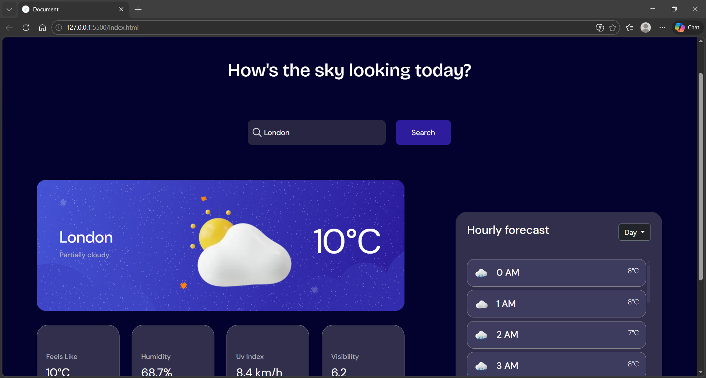

🌤️ Weather App
A responsive weather application built with HTML, CSS, Bootstrap, and a weather API. Get real time weather data for any city in the world with a clean, mobile-friendly interface.

📸 Preview

🚀 Features

🔍Search weather by city name;
🌡️Displays temperature, humidity, UV index, visibility, and weather conditions;
🌍Works for cities worldwide;
📱Fully responsive design using Bootstrap 5;
⚡Real-time data fetched from a weather API.

🛠️ Built With

HTML5 — Structure
CSS3 — Custom styling
Bootstrap 5 — Responsive layout and components
JavaScript — Logic and API calls
VisualCrossing API — Weather data

📁 Project Structure
weather-app/
├── index.html       #Main HTML file
├── index.css        #Custom styles
├── index.js         #JavaScript and API logic
└── README.md        #Project documentation

📱 Responsive Design
The layout adapts seamlessly across:

- Mobile phones
- Tablets
- Desktops

👤 Author
@jothegirlie

GitHub: @jothegirlie
LinkedIn: https://www.linkedin.com/in/johanna-lang-81aa0a30b/